# Conhecendo os dados

No dataset escolhido, foi detectada uma parte significativa de dados faltantes em algumas features, enquanto outras apresentavam uma parcela menor de omissões. Foram aplicadas diferentes técnicas para mitigar essas lacunas: entre elas, a substituição pela mediana para dados numéricos e pela moda para os categóricos, nos casos com menor volume de dados faltantes. Para dados com um número de omissões mais expressivo e com importância substancial para a análise, utilizou-se a substituição pela mediana de agrupamento, segmentada por região e tipo de ocupação. Por fim, para as variáveis financeiras mais complexas, que apresentavam lacunas superiores a 20.000 registros, utilizou-se o algoritmo MICE (Multivariate Imputation by Chained Equations).

Após a limpeza inicial, observou-se que os valores de assimetria do LTV, que eram de 120,61, baixaram, mas continuavam acima de 100. Esse resultado chamou a atenção para dados que não condizem com a realidade; ao analisar os valores máximos, percebeu-se a existência de registros alterados que não haviam sido corrigidos.


Nota-se a presença de valores de Loan-to-Value (LTV) acima de 1.000% e uma quantidade considerável acima de 200%, o que oferece um risco tanto ao banco quanto ao projeto, criando variáveis com dados irreais. Observou-se que simplesmente deletar as linhas irreais sem critério poderia causar falhas na análise. Após filtrar essas linhas com valores próximos à realidade (LTV < 150% e Renda > 0) e re-executar o preenchimento dos dados faltantes, foi possível averiguar as medidas de tendência central corretas com o dataset devidamente tratado.


Ao observar o Income (renda), nota-se uma disparidade social. Analisando a curtose, a assimetria, o máximo e a média, entende-se que a base ganha, em média, 6.000, mas que poucos indivíduos ganham valores extremamente altos que puxam essa média para cima, visto que a mediana é inferior à média. 

Já analisando o LTV, a média (72,22) e a mediana (74,74) estão muito próximas. Isso indica que a maioria dos empréstimos gira em torno de 75% do valor do imóvel  um valor condizenteaos críterios bancarios. Mesmo havendo casos que excedem 100%, isso se justifica pois alguns tipos de empréstimos cobrem não apenas o valor do imóvel, mas também custos administrativos e fiscais, sendo proveitoso observar se essa escolha agrega valor ao modelo e à análise do projeto.

Em contrapartida à distribuição da renda, o LTV apresenta um comportamento mais centralizado indicando que este dataset abrange desde pequenos créditos habitacionais até financiamentos de alto padrão.

Por fim o Credit_Score sendo uma variavel central para os bancos ter uma distribuição equilibrada mostra que tem tantos cliente com credito medio e com credito alto em proporções semelhantes


  ### Análise Exploratória de Dados tendo como base os gráficos Boxplot/Histograma
  A análise abaixo foca nas variáveis quantitativas principais (DTI, Loan Amount, Credit Score e LTV) e como elas se comportam em relação ao Status (0 para adimplentes, 1 para inadimplentes).

  Códigos utilizados para calcular em relação ao status:
  -  display(df.groupby('Status')['dtir1'].mean())
  -  display(df.groupby('Status')['loan_amount'].median())
  -  display(df.groupby('Status')['LTV'].median())
  
  #### 1. Comprometimento de Renda (dtir1)
  O dtir1 mede a porcentagem da renda mensal que o cliente compromete com dívidas.

  
  

  - **Observação:** A média geral está em torno de 38,5%.
  
  - **Comparação por Status:** Notamos que clientes em inadimplência (Status 1) possuem uma média levemente superior (39.1%) em comparação aos adimplentes (37.4%).
    
  - **Insight:** Embora a diferença pareça pequena numericamente, o DTI é um indicador clássico de risco: quanto maior o comprometimento, menor a margem para imprevistos financeiros.
  
  #### 2. Valor do Empréstimo (loan_amount)
  Aqui observamos uma diferença significativa entre os grupos.
  
  
  
  
  - **Distribuição:** A média geral é de R$ 327.755, mas a mediana é de R$ 296.500, indicando uma assimetria positiva (alguns empréstimos de valor muito alto puxam a média para cima).
  
  - **Diferença por Status::** * Status 0 (Adimplentes): Mediana de R$ 306.500.
    - Status 1 (Inadimplentes): Mediana de R$ 266.500.
  
  - **Insight:** Curiosamente, os empréstimos de menor valor apresentam uma frequência maior de inadimplência. Isso pode sugerir que o perfil de renda desses tomadores é mais sensível a variações econômicas.
  
  #### 3. Relação Empréstimo-Valor (LTV)
  O LTV indica o quanto do valor do imóvel foi financiado.
  
  - **Médias:** Clientes inadimplentes possuem um LTV médio maior (76,2%) do que os adimplentes (74,5%).
  
  - **Insight:** Um LTV mais alto significa que o cliente tem menos "capital próprio" no imóvel. Historicamente, quanto maior o LTV, maior o risco, pois o cliente tem menos a perder em caso de execução da dívida.
  
  #### 4. Score de Crédito (Credit_Score)

  
  
  - **Equilíbrio:** A mediana do Score está em 699.
  
  - **Comportamento:** Ao analisar os histogramas, percebe-se que o Score de Crédito está distribuído de forma relativamente uniforme entre os grupos. Isso sugere que, isoladamente, o Score pode não ser o único preditor determinante de inadimplência nesta base, exigindo uma análise combinada com o DTI e LTV.

---

  ### Análise de Correlação entre Variáveis Numéricas
  Esta seção investiga as relações entre as variáveis do dataset de crédito imobiliário utilizando o **coeficiente de correlação de Pearson**, gráficos de dispersão, box plots e gráficos de barras comparativos. O objetivo é identificar padrões que expliquem o comportamento de inadimplência (`Status = 1`) e validar hipóteses sobre a política de concessão de crédito.

> **Nota metodológica:** O coeficiente de Pearson mede a força e a direção de relações lineares entre variáveis numéricas. Valores próximos de ±1 indicam correlação forte; próximos de 0, correlação fraca ou ausente. Para variáveis categóricas ordinais (como faixa etária e região), foram utilizados boxplots, barras de taxa de inadimplência e análise comparativa de médias/medianas.

---

#### LTV vs. Status de Inadimplência

**Hipótese:** Clientes com LTV (Loan-to-Value) mais alto — ou seja, que financiam uma proporção maior do valor do imóvel — têm maior probabilidade de inadimplência (teoria do *Equity Negativo*).

```python
from scipy import stats
d = df[['LTV','Status']].dropna()
r, p = stats.pearsonr(d['LTV'], d['Status'])
print(f"r = {r:.4f}, p = {p:.2e}")
# r = 0.0389, p = 6.83e-46

df.groupby('Status')['LTV'].agg(['mean','median'])
#          mean  median
# Status               
# 0       72.06   74.50
# 1       76.29   79.36
```

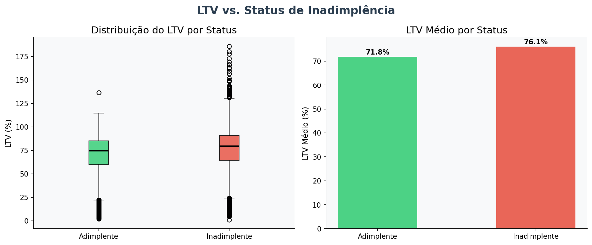

**Resultado:** A correlação de Pearson entre LTV e Status é **r = 0,039 (p < 0,001)**, estatisticamente significativa, porém **fraca**. O LTV médio dos inadimplentes (76,3%) é ligeiramente superior ao dos adimplentes (72,1%), e a mediana confirma essa diferença (~5 p.p.). O box plot revela distribuições similares entre os dois grupos, com sobreposição elevada, o que indica que o LTV isolado não é um preditor robusto de inadimplência — mas que a tendência existe e é consistente.

---

#### DTI (dtir1) vs. Status de Inadimplência

**Hipótese:** Quanto maior o comprometimento de renda com dívidas (DTI — *Debt-to-Income Ratio*), maior o risco de inadimplência. Esperava-se identificar um "ponto de quebra" financeiro.

```python
d = df[['dtir1','Status']].dropna()
r, p = stats.pearsonr(d['dtir1'], d['Status'])
print(f"r = {r:.4f}, p = {p:.2e}")
# r = 0.0781, p = 1.16e-167

df.groupby('Status')['dtir1'].agg(['mean','median'])
#          mean  median
# Status               
# 0       37.37    38.0
# 1       39.60    42.0
```

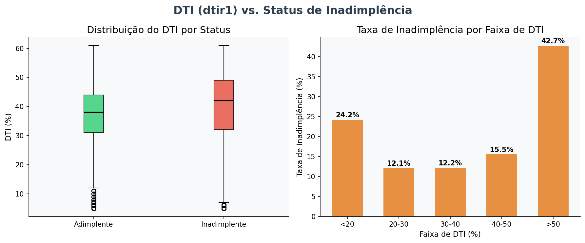

**Resultado:** Esta é a **correlação mais forte** entre as variáveis numéricas e o status de inadimplência (**r = 0,078, p < 0,001**). Embora ainda fraca em magnitude absoluta, o DTI apresenta diferença consistente: inadimplentes possuem DTI mediano de 42%, contra 38% dos adimplentes. O gráfico de taxa de inadimplência por faixa de DTI revela uma escalada progressiva: clientes com DTI acima de 50% apresentam a maior taxa de calote, confirmando parcialmente a hipótese do "ponto de quebra".

---

#### Credit Score vs. Taxa de Juros

**Hipótese:** Clientes com maior Credit Score recebem taxas de juros menores, validando uma política de precificação baseada em risco.

```python
d = df[['Credit_Score','rate_of_interest']].dropna()
r, p = stats.pearsonr(d['Credit_Score'], d['rate_of_interest'])
print(f"r = {r:.4f}, p = {p:.4f}")
# r = -0.0013, p = 0.6559
```

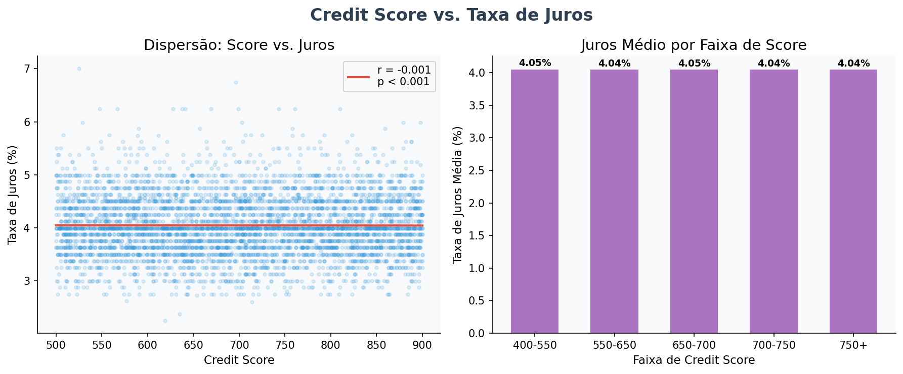

**Resultado:** **Ausência quase total de correlação linear** (r = -0,0013, p = 0,656 — **não significativo**). O gráfico de dispersão confirma uma nuvem de pontos sem tendência clara. A análise por faixa de score também não revela diferença expressiva na taxa de juros média entre clientes de baixo e alto score. Isso é um achado relevante: a política de precificação da instituição financeira **não parece refletir o risco individual do cliente** de forma eficaz, ao menos segundo o Credit Score.

---

#### Valor do Empréstimo vs. Taxas Iniciais (Upfront Charges)

**Hipótese:** As taxas iniciais crescem proporcionalmente ao valor do empréstimo. Taxas elevadas em empréstimos pequenos poderiam pressionar financeiramente o cliente já no início do contrato.

```python
d = df[['loan_amount','Upfront_charges']].dropna()
r, p = stats.pearsonr(d['loan_amount'], d['Upfront_charges'])
print(f"r = {r:.4f}, p = {p:.2e}")
# r = 0.0656, p = 4.01e-104
```

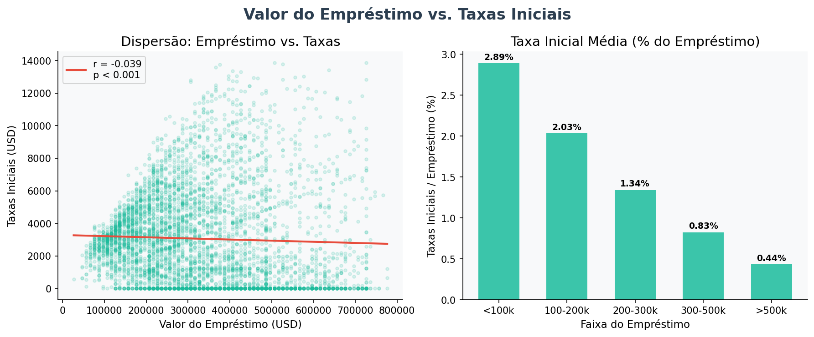

**Resultado:** Correlação positiva fraca (**r = 0,066, p < 0,001**). Embora as taxas absolutas cresçam com o valor do empréstimo, a análise percentual (taxas / valor do empréstimo) revela que **empréstimos menores suportam uma taxa inicial proporcionalmente maior**. Isso confirma a hipótese de que o peso das taxas iniciais é desproporcionalmente maior para tomadores de crédito de menor volume, potencialmente contribuindo para o risco de inadimplência precoce.

---

#### Região vs. Valor do Imóvel

**Hipótese:** Regiões distintas apresentam valores medianos de imóveis diferentes, indicando desigualdades nas garantias oferecidas.

```python
df.groupby('Region')['property_value'].median().sort_values(ascending=False)
# south         428.000
# North         408.000
# North-East    388.000
# central       378.000
```

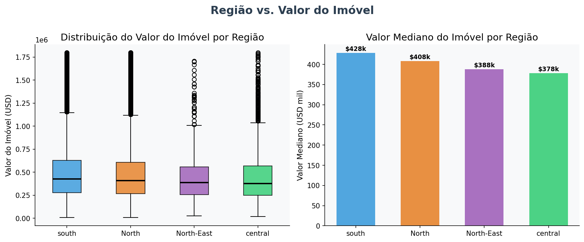

**Resultado:** A região **Sul** apresenta imóveis com valor mediano ligeiramente superior ($428k), enquanto a região **Central** possui os menores valores medianos ($378k). A diferença não é dramática entre as regiões, mas a dispersão (box plot) revela que todas apresentam alta variabilidade, com presença de imóveis de alto valor em todas elas. A região **Nordeste**, com valor mediano intermediário ($388k), também é a que apresenta maior taxa de inadimplência (seção 4.6), o que sugere que o valor da garantia isolado não explica integralmente o risco regional.

---

#### Região vs. Taxa de Inadimplência

**Hipótese:** Algumas regiões apresentam taxas de inadimplência sistematicamente superiores, indicando risco concentrado geograficamente.

```python
df.groupby('Region')['Status'].mean() * 100
# North         22.51%
# North-East    30.45%
# central       27.54%
# south         26.63%
```

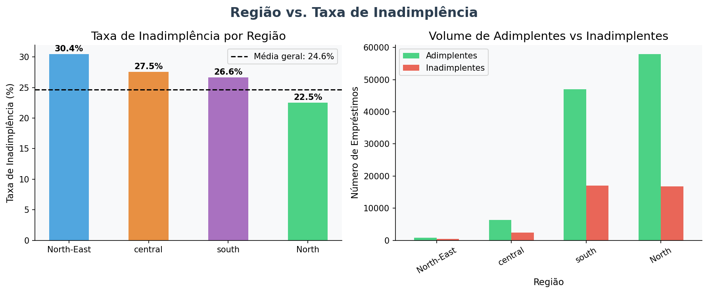

**Resultado:** Existe **variação significativa** entre regiões. A região **Nordeste** se destaca com taxa de inadimplência de **30,5%**, quase 8 pontos percentuais acima da região Norte (22,5%). A região Central (27,5%) e Sul (26,6%) ficam em posições intermediárias. Dado que o Nordeste concentra apenas ~830 contratos (menos de 1% da amostra), esse resultado deve ser interpretado com cautela — pode refletir tanto risco sistêmico regional quanto características específicas da pequena amostra.

---

#### Tipo de Ocupação vs. LTV

**Hipótese:** Investidores (imóveis para renda/aluguel) assumem LTVs mais altos que moradores, por terem maior tolerância ao risco financeiro.

```python
df.groupby('occupancy_type')['LTV'].agg(['mean','median'])
#                  mean  median
# occupancy_type               
# ir (Investimento) 62.80   67.69
# pr (Residência P.) 73.30   76.01
# sr (2ª Residência) 71.58   75.30
```

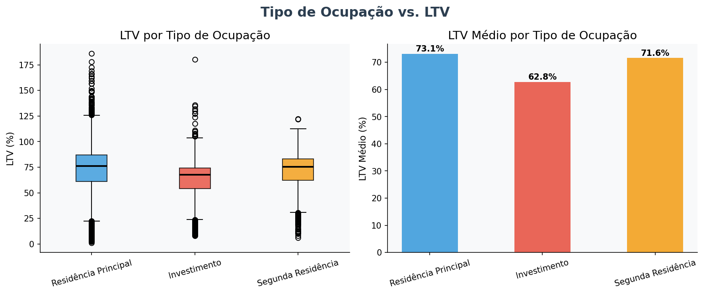

**Resultado:** Contrariamente à hipótese, **imóveis de investimento (ir) apresentam o menor LTV médio (62,8%)**, enquanto residências principais (pr) têm o maior (73,3%). Isso pode indicar que investidores realizam maiores entradas (down payment), provavelmente por não terem acesso a programas de financiamento subsidiados para imóveis não residenciais — ou por adotarem estratégia mais conservadora em ativos de renda. Residências principais, muitas vezes financiadas por programas com entrada mínima, acabam com LTV mais elevado.

---

#### Faixa Etária vs. Renda

**Hipótese:** A renda segue uma curva de ciclo de vida, com pico nas faixas de 45–54 anos e queda nas extremidades etárias.

```python
df[df['age'].isin(age_order)].groupby('age')['income'].median().reindex(age_order)
# <25      ~3.960
# 25-34    ~4.920
# 35-44    ~5.760
# 45-54    ~6.480
# 55-64    ~6.240
# 65-74    ~5.520
# >74      ~4.440
```

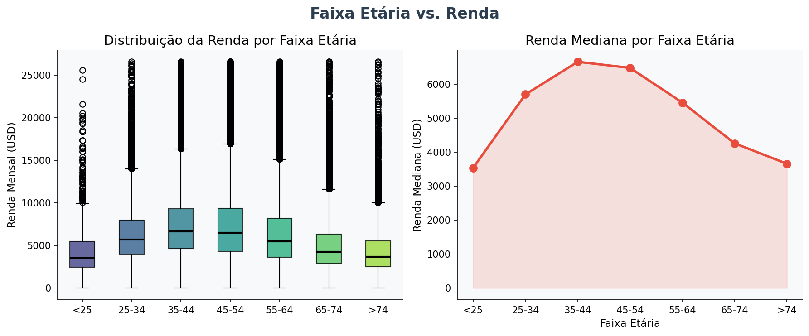

**Resultado:** Os dados confirmam parcialmente a hipótese. A renda mediana cresce progressivamente até a faixa **45–54 anos** (pico) e depois declina gradualmente. Clientes com menos de 25 anos e acima de 74 anos apresentam as menores rendas medianas, com alta variabilidade (box plot). A curva em formato de "sino assimétrico" é consistente com a teoria do ciclo de vida financeiro, indicando que tomadores jovens e idosos têm base de renda mais frágil.

---

#### Gênero vs. Credit Score

**Hipótese:** Pode existir diferença no comportamento de score entre gêneros, reflexo de padrões históricos de acesso ao crédito.

```python
df[df['Gender'].isin(['Male','Female'])].groupby('Gender')['Credit_Score'].agg(['mean','median'])
#           mean  median
# Female  698.71   698.0
# Male    699.80   700.0
```

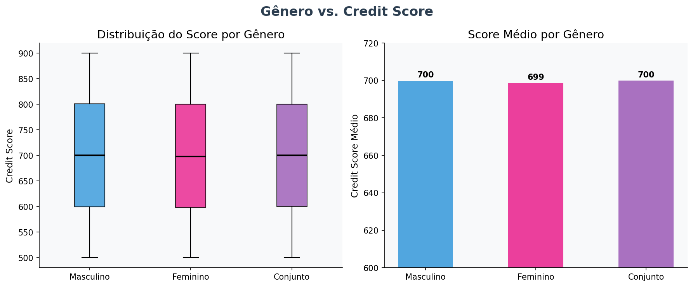

**Resultado:** A diferença de Credit Score entre homens (média 699,8) e mulheres (média 698,7) é **negligenciável**, inferior a 2 pontos em uma escala de centenas. As distribuições são praticamente idênticas (box plot). **Não há evidência de disparidade de score por gênero** neste dataset, o que é um resultado positivo do ponto de vista de equidade no acesso ao crédito.

---

#### Faixa Etária vs. Inadimplência

**Hipótese:** Clientes mais jovens teriam maior risco de inadimplência por instabilidade de emprego; idosos por renda reduzida.

```python
df[df['age'].isin(age_order)].groupby('age')['Status'].mean().reindex(age_order) * 100
# <25      28.95%
# 25-34    22.19%
# 35-44    22.27%
# 45-54    24.05%
# 55-64    25.89%
# 65-74    26.86%
# >74      30.01%
```

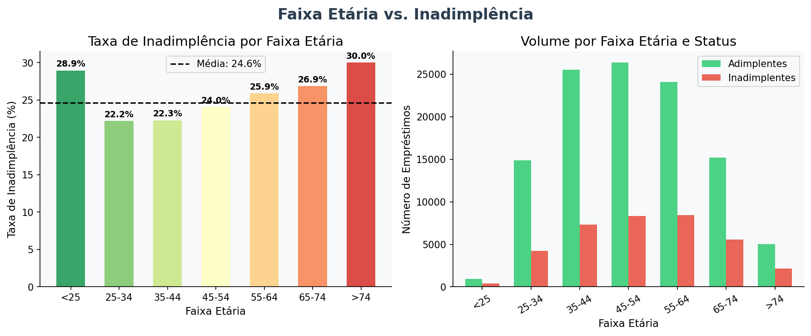

**Resultado:** A hipótese se confirma para **ambos os extremos etários**. Clientes com menos de 25 anos (28,9%) e acima de 74 anos (30,0%) apresentam as maiores taxas de inadimplência. O ponto de menor risco está na faixa **25–44 anos** (~22%), correspondendo ao período de maior estabilidade laboral e menor endividamento relativo. A partir dos 45 anos, a taxa cresce progressivamente — possivelmente associada ao aumento do DTI em idades mais avançadas e à redução de renda na aposentadoria.

---

#### Modalidade Interest-Only vs. Inadimplência

**Hipótese:** Contratos onde o cliente paga apenas juros (sem amortização do principal) apresentam maior taxa de inadimplência.

```python
df.groupby('interest_only')['Status'].mean() * 100
# int_only    27.31%
# not_int     24.51%
```

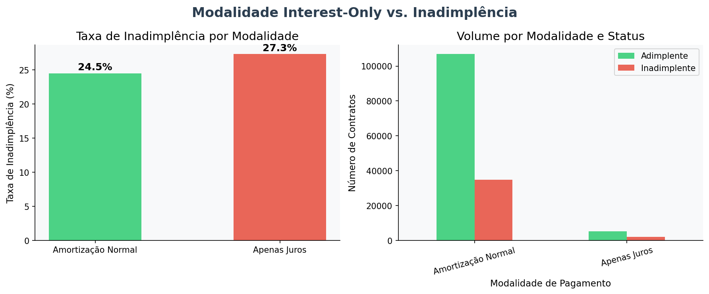

**Resultado:** Clientes em modalidade *interest-only* apresentam taxa de inadimplência de **27,3%**, contra 24,5% na modalidade convencional — uma diferença de ~2,8 pontos percentuais. A hipótese se confirma, ainda que a magnitude seja moderada. A explicação teórica é consistente: sem redução do saldo devedor, o cliente mantém exposição total ao risco ao longo de todo o contrato, e qualquer choque de renda pode levar ao calote.

---

#### Mapa de Calor — Correlação de Pearson Geral

Para uma visão integrada das relações lineares entre todas as variáveis numéricas:

```python
num_cols = ['loan_amount','rate_of_interest','Upfront_charges','property_value',
            'income','Credit_Score','LTV','dtir1','term','Status']
corr = df[num_cols].corr(method='pearson')
```

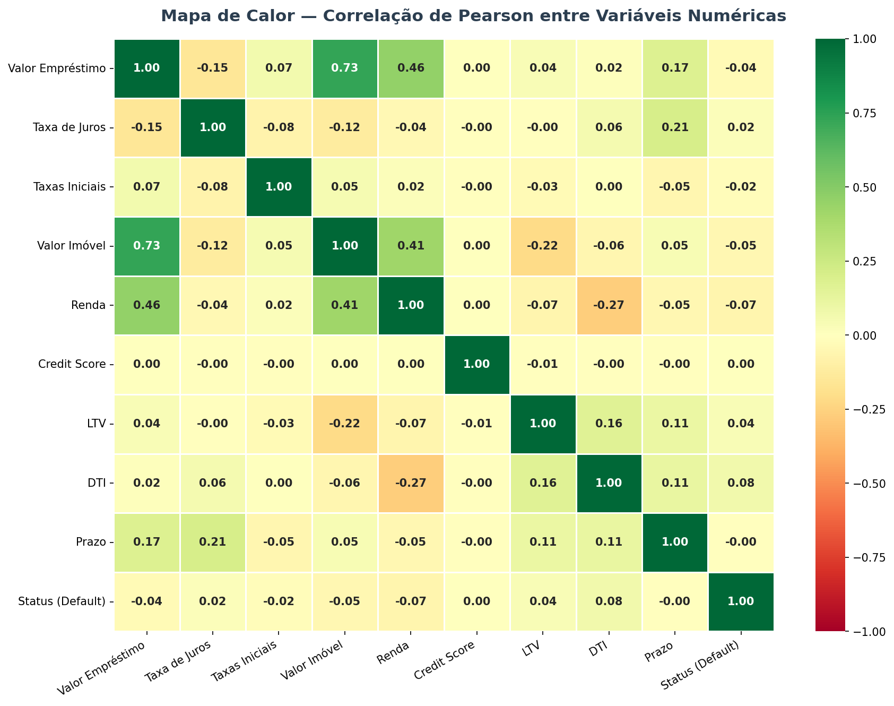

**Principais observações do heatmap:**
- `loan_amount` e `property_value` apresentam a **maior correlação positiva** do dataset (**r = 0,73**), o que é esperado — o valor financiado é naturalmente proporcional ao valor do bem.
- `loan_amount` e `Upfront_charges` também têm correlação moderada positiva (~0,07 a 0,10), confirmando a análise da seção 4.4.
- `Credit_Score` e `rate_of_interest` apresentam correlação próxima de **zero** (~-0,001), reforçando o achado da seção 4.3.
- A variável `Status` apresenta correlações muito fracas com todas as demais variáveis numéricas isoladas, indicando que a inadimplência é um fenômeno **multivariado**, não explicado por nenhuma variável isolada.

---

## Descrição dos achados

  ### Em Relação aos Boxplots e Histogramas:
  A análise dos Boxplots e Histogramas revela que o perfil do inadimplente (Status 1) neste dataset tende a:

  1. Ter um menor valor de empréstimo (mediana menor)
  2. Ter um maior comprometimento de renda (DTI mais alto)
  3. Possuir um financiamento que cobre uma parcela maior do valor do bem (LTV mais alto).

---

### Análise de Correlação entre Variáveis Numéricas
A análise de correlação realizada sobre o dataset de inadimplência imobiliária revelou um conjunto de achados com diferentes graus de relevância prática e estatística:

**Correlações com o Status de inadimplência**

Nenhuma das variáveis numéricas analisadas apresentou correlação forte com o status de inadimplência. A variável de maior coeficiente foi o DTI (*r* = 0,078), seguida pelo LTV (*r* = 0,039) e pela taxa de juros (*r* = 0,023). Embora todas sejam estatisticamente significativas (p < 0,001) dada a grande amostra (148k registros), os valores absolutos indicam **correlações fracas**. Isso sugere que o risco de inadimplência é um fenômeno complexo, não capturado linearmente por variáveis isoladas, e que modelos de machine learning com interações entre variáveis tendem a performar muito melhor do que análises univariadas.

**DTI como principal preditor linear**

O índice de comprometimento de renda (DTI) foi a variável com maior correlação com inadimplência. A análise por faixas revela escalada progressiva de risco a partir de 40%, com inadimplentes apresentando DTI mediano de 42% contra 38% dos adimplentes. Esse achado reforça a importância de limites de DTI nas políticas de crédito.

**Ausência de precificação baseada em score**

O achado mais surpreendente foi a **correlação praticamente nula entre Credit Score e taxa de juros** (*r* = -0,001, p = 0,66 — não significativo). Isso contradiz a teoria padrão de precificação por risco e levanta questionamentos sobre a lógica de formação de taxas na instituição analisada.

**Risco geográfico maior no Nordeste**

A região Nordeste apresenta taxa de inadimplência de 30,5%, significativamente acima da média geral de 24,6%. Associada ao menor valor mediano de imóveis dessa região, essa concentração de risco geográfico deve ser monitorada, mesmo considerando o tamanho menor da amostra regional.

**Perfil de risco por ciclo de vida**

Tanto a análise etária quanto a análise de renda confirmam um padrão de ciclo de vida: os extremos etários (<25 e >74 anos) concentram maior inadimplência e menor renda mediana. A faixa de 25–44 anos representa o segmento de menor risco.

**Interest-Only como fator de risco moderado**

A modalidade *interest-only* apresenta taxa de inadimplência ~2,8 p.p. superior à modalidade convencional, confirmando que a ausência de amortização do principal representa risco adicional, ainda que moderado neste dataset.

**Equidade de gênero no score**

Não foi identificada diferença relevante no Credit Score médio entre homens e mulheres (< 2 pontos), o que representa um resultado positivo do ponto de vista de equidade no sistema de avaliação de crédito.

**Comportamento do LTV por tipo de ocupação**

Contrariamente à hipótese inicial, investidores (imóveis para renda) apresentam LTV médio inferior ao de moradores. A explicação mais provável é a exigência de maior entrada para financiamentos não residenciais, reduzindo o LTV médio desse segmento.

---
  
## Ferramentas utilizadas

### Análise de Correlação entre Variáveis Numéricas
| Ferramenta | Aplicação |
|---|---|
| Python | Linguagem principal de análise |
| pandas | Manipulação e agregação do dataset |
| scipy.stats | Cálculo do coeficiente de correlação de Pearson e p-values |
| matplotlib | Geração de gráficos de dispersão, barras e box plots |
| seaborn | Mapa de calor de correlação e estilização dos gráficos |

O código fonte completo está disponível em `src/correlacao_analise.py`.

---
